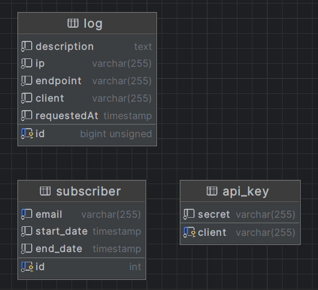

# ListWibuKu - Soap Service

ListWibuKu is a SOAP service that manage user subscription.

## Contributors

1. Akbar Maulana Ridho (13521093)
2. Eugene Yap Jin Quan (13521074)

## Database Schema

## SOAP Action Endpoints

1. `createSubscriber(int userId, String email)` endpoint to start user subscription. Return null or subscriber object
2. `renewSubscriber(int userId)` endpoint to renew user subcription. Return null or subscriber object
3. `getSubscriber(int userId)` endpoint to check user subscription. Return null or subscriber object

## Requirement

1. Docker installed

## Installation Guide

1. Clone repo
2. Inside the repository, run `docker compose up`

## How to Send Request

Add this header before doing SOAP request.

`Authorization: your_api_key`

## Service Information

- Mysql was run on port 3307
- Soap service was run on port 3001 at endpoint `/subscriberservice`
- Mailhog SMTP server was run on port 1025
- Mailhog HTTP server was run on port 8025

## Bonus Feature - Mailer

User will be notified via email when their subscription is started or renewed through local SMTP server.

## Contributions

| Tugas             | NIM      |
| ----------------- | -------- |
| User subscription | 13521074 |
| Logger            | 13521093 |
| Api Key           | 13521093 |
| Bonus Mailer      | 13521093 |
